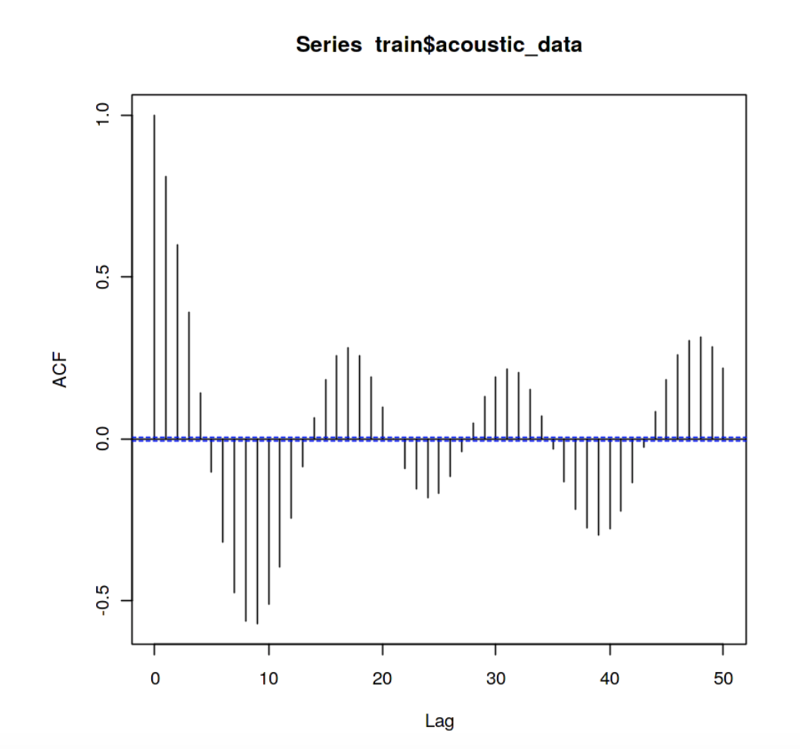
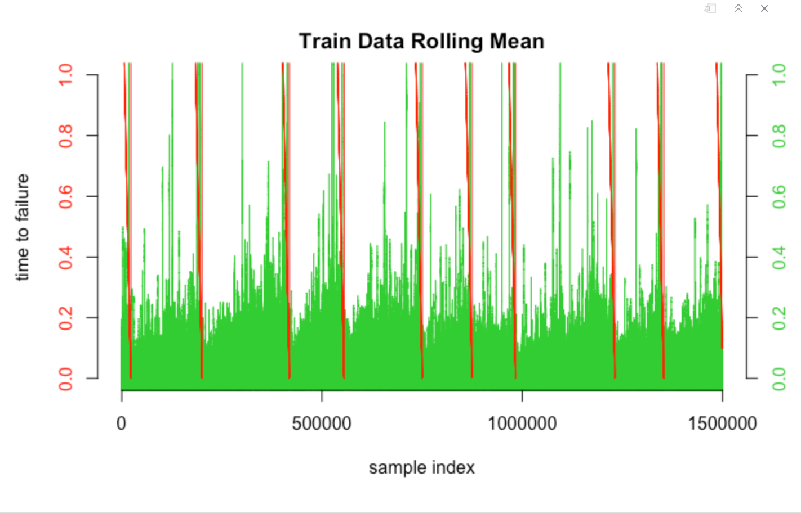
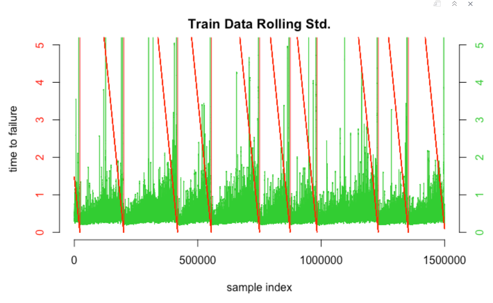

---
output:
  word_document: default
  html_document: default
---
# EAPS 507 Final Project RMarkdown File
### Student: Isabella Zuffoletti


```{r setup, include=FALSE}
knitr::opts_chunk$set(echo = TRUE)
```

## Project Goal

In this project I will explore a dataset provided by Los Alamos National Lab (LANL), a US national laboratory concerned with national security. This dataset was produced by a series of experiments that aimed to replicate the stick-slip behavior of faults that produce major earthquakes. The data is a continous waveform with a quasi-periodic nature, and an associated time until ground failure. This dataset was released to the public as a Kaggle competition, so data scientists could compete for the best solution to this unknown problem- can you predict earthquakes based on seismic data alone? 

This question proposed by LANL poses a simple regression problem of one variable- the waveform, with the predicted value being the time of ground failure. However, many different versions of the solution were produced, with combinations of signal pre-processing, regression model selection, and feature extraction. 

The implication of a solid solution to this problem is the ability monitor the national seismic network, a produce a better early warning system for major earthquakes. Advancing early warning systems by even seconds can prevent significant costs. For example, pausing surgeries, evacuating buildings, and protecting critical infastructure can all be improved with a few nore seconds of warning.

    Link to kaggle competition: https://www.kaggle.com/c/LANL-Earthquake-Prediction


```{r}
# Define function to plot a waveform with time until failure
# y1 is acoustic signal and y2 is time to failure
plot_wave <- function(x, y1, y2){
  plot.new()
plot.window(xlim=range(x), ylim=range(y1))
lines(x, y1, col="red")
axis(1)
axis(2, col.axis="red")
box()

plot.window(xlim=range(x), ylim=range(y2))
lines(x, y2, col="limegreen", pch=19)
axis(4, col.axis="limegreen") }
```
# ============== DOWNSAMPLING ==============
\n The original waveform was downsampled by pulling only 1 our of every 250 rows in the original continuous train time series. This is still a continuous time series, but at a lower resolution. I break this  continuous waveform, provided in "train.csv", into test and train sets. This is because the test segments provided with the Kaggle competition do not have an attached "time to failure". The goal of the competition is to best calculate the time to failure, although no one knows the true answer.

    Original train file size: 9 Gigabytes
    Downsampled train file size: 1,500,000 rows, 2 columns, 36.7 megabytes
    Downsampled train file size: 1,016,582 rows, 2 columns, 22.7 megabytes

This code does not need to be run, but shows how the file was downsampled using the command line from RStudio. I import the results in the next block of code.

```{r}
  #file.pipe <- pipe("awk '  BEGIN{i=0}{i++;if (i%250==0) print $1}' < train.csv")
  #df <- read.csv(file.pipe, nrows=1000000, header=FALSE)
  #df

  #file.pipe <- pipe("awk '  BEGIN{i=0}{i++;if (i%250==0) print $1}' < train.csv")
  #df <- read.csv(file.pipe, nrows=5000000, header=FALSE)
  
  #write.csv(df[1:1500000, ], "downsampled_train.csv")
  #write.csv(df[1500000:nrow(df), ], "downsampled_test.csv")
```

### Read data and initial cleanup
\n The labeled train data provided was broken into test and train sets, so the model error can be tested. Because this is a continuous time series broken into segments, this may be more correlated than the random segments provided above. However, this is the only other labeled data we were provided with by LANL. 
```{r}
# Read data and cleanup column names
train <- read.csv("downsampled_train.csv")
headers <- c("index", "acoustic", "time_to_failure")
colnames(train) <- headers
test <- read.csv("downsampled_test.csv")
colnames(test) <- headers
# reorder our index (no longer a continuous waveform with train)
test$index <- test$index-1499999
# Cut off test set so that we can break into equal sized segments of 600 rows
test <- test[1: ((nrow(test) %% 600)*600),]

# View train data properties
summary(train)
summary(test)
```

\n Similarly, this block of code does some pre-downsampling of the unlabeled test segments, in order to provide data with a consistent sampling interval to our model.

```{r}
# original file = 150,000 rows
# downsampled file = 600 rows
#file.pipe <- pipe("awk '  BEGIN{i=0}{i++;if (i%250==0) print $1}' < seg_00030f.csv")
#df <- read.csv(file.pipe, nrows=600, header=FALSE)
#write.csv(df[1:nrow(df), ], "seg_00030f_downsampled.csv")

#file.pipe <- pipe("awk '  BEGIN{i=0}{i++;if (i%250==0) print $1}' < seg_0012b5.csv")
#df <- read.csv(file.pipe, nrows=600, header=FALSE)
#write.csv(df[1:nrow(df), ], "seg_0012b5_downsampled.csv")

# These are unlabeled test segments, which only include the acoustic measurements. The submission for the Kaggle competition was an estimated time of failure for each of these segments. I imported only 2.
test1 <- read.csv("seg_00030f_downsampled.csv")
colnames(test1) <- c("index", "acoustic")
test2 <- read.csv("seg_0012b5_downsampled.csv")
colnames(test2) <- c("index", "acoustic")
head(test1)
```
\n
# ======= PART 1: EXPLORATORY DATA ANALYSIS =======
\n
```{r}
# From table view, depending on the rounding, the time_to_failure column may appear to have the same value for multiple rows. However, we can print with more significant digits to show the values are changing 
head(train)
print(train$time_to_failure[1:5], digits=10)

# We can also calculate our sampling interval easily from the dataset. The difference in "time_to_failure" between each pair of points is constant. This is demonstrated below.
sampling_int <- train$time_to_failure[1] - train$time_to_failure[2]
sampling_int
sampling_int2 <- train$time_to_failure[2] - train$time_to_failure[3]
sampling_int2
```

### Autocorrelation
```{r}
# This is code used to plot the full data set, but to avoid importing the large file, I will include an image instead
# acf(train$acoustic_data, lag.max= 50)

```

\n The data set before down sampling (lowering the sampling interval by taking only one of every few rows) is beautifully autocorrelated for short lags. The alternating positive and negative correlation with increasing lag may be due to vibrations effects in the experimental setup for taking  seismic measurements in a laboratory.
```{r}
# This line plots our downsampled data autocorrelation
acf(train$acoustic, lag.max= 50)

```

\n By downsampling the autocorrelation pattern seen above have almost completely disappeared. Therefore, I do not expect autocorrelation to be a significant predictor in the model to predict time of ground failure, made from the downsampled data set. However, this may be a more significant factor if the full 9 GB dataset was used.

### Plotting the waveform & failure cycles
```{r}

# First we plot the full downsampled train dataset
plot_wave(train$index, train$acoustic, train$time_to_failure)

# With the time of ground failure labeled in this seismic dataset, we know which big signals are   earthquakes and which are just noise. 

# Now we zoom in on one earthquake
plot_wave(train$index[190000:205000], train$acoustic[190000:205000], train$time_to_failure[190000:205000])
```

\n There is a clear lag time between the measured signal the the recorded ground failure. Our model should be able to place the time of ground failure a short time after the large amplitude signal.


### Data distribution
\n We can look at the distribution of the acoustic signals to better understand how we can differentiate noise and earthquakes. Understanding how to differentiate the two can guide feature generation. 
```{r}
# The boxplots shows that the IQR includes a very small range. We can conclude that earthquakes are large outliers in our waveform data, which is useful for our analysis.
boxplot(train$acoustic, main="Boxplot All Acoustic Signals", xlab="acoustic amplitude")

# Plotting only the interquartile range, we see the distribution of non-earthquake signals is almost Gaussian. However, it the non-earthquake signals are not centered on zero, so we will apply a normalization.
q1 <- quantile(train$acoustic)[2]
q3 <- quantile(train$acoustic)[4]
boxplot(train$acoustic[train$acoustic >= q1 & train$acoustic <= q3], ylab = "acoustic amplitude", main="Boxplot Acoustic Signals w/ No Outliers")
```

### Data Normalization
\n Because the mean of the acoustic data is not zero, we should normalize this column before further analysis.
```{r}
# First we make a copy of the train data to scale, so we can compare the two
train_scaled <- train
train_scaled$acoustic <- scale(train$acoustic)
# Summary of before and after normalization for comparison
summary(train$acoustic)
summary(train_scaled$acoustic)

# Good! We still have large values where the earthquakes should be given the plotted time of failture, but have normalized our data, so the mean is now zero.
plot_wave(train_scaled$index, train_scaled$acoustic, train_scaled$time_to_failure)

# Now that we have compared the data before and after normalization and like the results, we can overwrite our train data.
train <- train_scaled
```
### Periodogram
\n The periodogram plot shows the contributions of the individual frequencies to the time series. Significant patterns in the periodogram would suggest that further investigation into frequency as a predictor for earthquakes could be beneficial.
```{r, figures-side, fig.show="hold", out.width="50%"}

# The function spec.pgram() calculates the periodogram using a FFT, and optionally smooths the result with a series of modified Daniell smoother

# First we plot an estimate of the spectral density of the acoustic signal for individual segments of the data. The smoothing kernel used is a daniell kernel that takes a moving average.
kernel <- kernel("daniell", m = 5)
acoustic_ts <- ts(train$acoustic, frequency = 1/sampling_int)
seg_train <- split(acoustic_ts, (seq(nrow(train))-1) %/% 600) 
# Plot spectrums for a sample of segments
par(mfrow = c(2,3))
for (chunk in seg_train[1:6]){
  seg_pgram <- spec.pgram(chunk, kernel, demean = TRUE, plot = FALSE)
  plot(seg_pgram)
}
```

\n These periodograms contain a lot of spikes that make it difficult to analyze. This will only be more confusing if we plot the entire time series. The periodogram does not become smoother as the length of the time series increases but just includes more spikes packed closer together. Therefore smoothing would be beneficial before we plot the periodogram of the whole time series. Because of this I switch to a kernel that is able to smooth more. The kernel selected is a 5 by 5 daniell kernel, which takes a moving average of a moving average. 
```{r}
library("TTR")
kernel <- kernel("daniell", c(5, 5))
full_pgram <- spec.pgram(acoustic_ts, kernel,spans=5, demean = TRUE, plot = FALSE, na.action = na.exclude)
plot(full_pgram)
```

\n These results are not promising for using spectral density/ frequency as predictors for time of ground failure. The plots from individual segments do not show any trend. The lack of periodicity in this data is also evident in the plot of the entire time series, which appears as a solid mass, with a flat top. There are peaks at nearly every frequency of around the same height. The quasi-periodic trend of earthquake stick-slip behavior is likely not predictable by the frequency.

### Cumulative Distribution Plot
\n How close are large acoustic signals to ground failure??
By looking at the waveform plot, we can conclude that all earthquakes produce values greater than 100, and most well over 50. To answer this question we will look at the time to failure data for all signals that are >100.
Let's look further into the distribution of only large signals, which we attributed to laboratory produced earthquakes.
```{r}

plot(ecdf(train$time_to_failure[train$acoustic> 100]), main = 'Empirical Cumluative Distribution of Earthquake Signals')
mean(train$time_to_failure[train$acoustic> 100])
```

\n The cumulative distribution plot of earthquake signals shows that they are concentrated at less than a second before ground failure, with a mean value of 0.49 seconds. About 85-90% of large signals occur within .5 seconds of ground failure. All large signals are within 1 second of ground failure. The occurance of large signals may be a strong predictor of earthquakes, and should be considered in feature generation.\n
### Rolling mean and standard deviation
\n Before we generate features, let's look at one last potential predictor. Because the signal is greatest closest to earthquake occurrence, a rolling average of the acoustic signal should correlate with the time_to_failure
```{r}
# We will also calculate a rolling standard deviation and append it to the dataframe
# The rolling window size is small enough that we can get most of the signal in a rolling average, not averaging in the earthquake produced acoustic signal.
    # library(zoo)
    # 
    # window <- 50
    # padding <- rep(NA, window - 1)
    # train$rollingavg <- c(padding, rollapply(train$acoustic,window, mean))
    # window <- 100
    # padding <- rep(NA, window - 1)
    # train$rollingstd <-  c(padding, rollapply(train$acoustic,window, sd))

# We plot only small signals (acoustic<100), in order to look at how the earthquake building might be reflected in the waveform.
    # plot.new()
    # plot.window(xlim=range(train$index), ylim=c(0,1))
    # title(main="Train Data Rolling Mean", xlab="sample index", ylab="time to failure",)
    # lines(train$index[train$acoustic<100], train$rollingavg[train$acoustic<100], col="limegreen")
    # lines(train$index[train$acoustic<100], train$time_to_failure[train$acoustic<100], col="red")
    # axis(4, col.axis="limegreen",  ylim=range(train$rollingavg), )
    # axis(2, col.axis="red")
    # axis(1)
    
    # plot.new()
    # plot.window(xlim=range(train$index), ylim=c(0,5))
    # title(main="Train Data Rolling Std.", xlab="sample index", ylab="time to failure",)
    # lines(train$index[train$acoustic<100], train$rollingstd[train$acoustic<100], col="limegreen")
    # lines(train$index[train$acoustic<100], train$time_to_failure[train$acoustic<100], col="red")
    # axis(4, col.axis="limegreen",  ylim=range(train$rollingstd), )
    # axis(2, col.axis="red")
    # axis(1)


# Because this calculation takes a long time, I imported the plots it produced as images instead of running the code in this file. 



```

\n This step is computationally intensive, but is the most promising feature for detection based on EDA. Therefore, calculating the rolling mean & rolling std for each segment in our dataframe may produce better results. Rolling standard deviation and rolling mean are expected to be important predictors

There are signs of an earthquake building, even without averaging in earthquakes (large, acoustic>100) signals. This is promising for trying to predict time of ground failure from the seismic waveform alone. We know this is true because in the rolling mean plot below, the rolling mean builds slightly toward the time of earthquake. This is made evident by the cone shape of the rolling average (lime green), growing toward the right, before each occurrence of an earthquake. Therefore, there is stronger signal noise before an earthquake in this data set. \n
#  ======== PART 2: FEATURE GENERATION  ========
\n We next need to generate some features in order to create a model that predicts time of ground failure. 
```{r}
# First, we need to import packages and define some functions before we start feature generation in preparation for making a model.
library(dplyr)
library(kStatistics)
library(entropy)
library(zoo)

gm_mean = function(x, na.rm=TRUE){
  exp(sum(log(x[x > 0]), na.rm=na.rm) / length(x))
}

 add_trend_feature = function(x, y, abs_values=FALSE){
    if (abs_values == TRUE){
         x = abs(x)}
    p = coef(lm(c(y)~c(x), na.action=na.exclude))
    p[2]
 }
```

### Feature Generation Function
\n This is a function to generate 36 different features. Most features included are based on the data exploration in the previous sections.  At first I create some basic features, including mean, min, max, and quantiles, but by aggregating these features they can become more complex.
```{r}
# Define the function
generate_features = function(chunk, summary_df) {
     window <- 35
     padding <- rep(NA, window - 1)
     rollingavg <- c(padding, rollapply(chunk$acoustic,window, mean))
     rollingstd <-  c(padding, rollapply(chunk$acoustic,window, sd))
     autocorr = acf(chunk$acoustic, lag= 100, plot = FALSE, na.action = na.pass)
     seg_min  = min(chunk$acoustic, na.rm=TRUE)
     seg_max  = max(chunk$acoustic, na.rm=TRUE)
     # Suppress Warnings is used because data contains a few NaNs.
     suppressWarnings(
     summary_df <- rbind(summary_df, 
     c(
      seg_min,
      seg_max,
      seg_05   = quantile(chunk$acoustic, 0.05, na.rm=TRUE),
      seg_50   = quantile(chunk$acoustic, 0.50, na.rm=TRUE),
      seg_95   = quantile(chunk$acoustic, 0.95, na.rm=TRUE),
      seg_mean = mean(chunk$acoustic, na.rm = TRUE),
      seg_sd = sd(chunk$acoustic, na.rm = TRUE),
      seg_range = (seg_max - seg_min),
      max_min_ratio = abs(seg_max) / abs(seg_min),
      seg_big_count35 = length(chunk$acoustic[chunk$acoustic > 35]),
      seg_big_count50 = length(chunk$acoustic[chunk$acoustic > 50]),
      seg_big_count75 = length(chunk$acoustic[chunk$acoustic > 75]),
      seg_sum = sum(chunk$acoustic, na.rm=TRUE),
      mean_change_abs = mean(diff(chunk$acoustic, na.rm=TRUE)),
      harmonic_mean = 1/mean(1/abs(chunk$acoustic[chunk$acoustic>0]), na.rm=TRUE),
      geometric_mean = gm_mean(chunk$acoustic, na.rm=TRUE),
      seg_variance=nKS(2, chunk$acoustic),
      seg_skewness = nKS(3, chunk$acoustic)/sqrt(nKS(2, chunk$acoustic))^3 ,
      seg_kurtosis= nKS(4, chunk$acoustic)/nKS(2, chunk$acoustic)^2 + 3 ,
      meanAD = mad(chunk$acoustic, na.rm = TRUE),
      autocorr_1 = autocorr$acf[1],
      autocorr_10 = autocorr$acf[10],
      autocorr_100 = autocorr$acf[100],
      entropy = entropy(chunk$acoustic),
      slope = add_trend_feature(chunk$acoustic, chunk$index, abs_values = FALSE),
      slope_abs = add_trend_feature(chunk$acoustic, chunk$index, abs_values = TRUE),
      rollingavg_min = min(rollingavg, na.rm=TRUE),
      rollingavg_max = max(rollingavg, na.rm=TRUE),
      rollingavg_avg = mean(rollingavg, na.rm=TRUE),
      rollingavg_q05 = quantile(rollingavg, 0.05, na.rm=TRUE),
      rollingavg_q95 = quantile(rollingavg, 0.95, na.rm=TRUE),
      rollingstd_min = min(rollingstd, na.rm=TRUE),
      rollingstd_max = max(rollingstd, na.rm=TRUE),
      rollingstd_avg = mean(rollingstd, na.rm=TRUE),
      rollingstd_q05 = quantile(rollingstd, 0.05, na.rm=TRUE),
      rollingstd_q95 = quantile(rollingstd, 0.95, na.rm=TRUE)
      )))
     
}
headers_x <- c("seg_min", "seg_max", "seg_05", "seg_50", "seg_95", "seg_mean", "seg_sd", "seg_range", 'max_min_ratio', 'seg_big_count35','seg_big_count50','seg_big_count75', 'seg_sum','mean_change_abs', 'harmonic_mean', 'geometric_mean', 'seg_variance', 'seg_skewness','seg_kurtosis', 'meanAD','autocorr_1', 'autocorr_10', 'autocorr_100', 'entropy',"slope", "slope_abs", "rollingavg_min", "rollingavg_max", "rollingavg_avg", "rollingavg_q05","rollingavg_q95","rollingstd_min", "rollingstd_max", "rollingstd_avg", "rollingstd_q05","rollingstd_q95", "y")

```

\n For the remainder of our generated features, we can segment the data into chunks in order to create some features that generalize sections of the continuous time series. These features will be used to train our model.
\n I break up feature generation into segments of 600 rows. Why 600? Test segments are 600 rows each with my chosen rate of downsampling. A chunk size of 600 rows iterates through the 1,500,000 row train dataframe, 0.04% at a time.
```{r}
# Segmenting the train data and intializing dataframes to store the features produced from the segmented data
seg_train <- split(train, (seq(nrow(train))-1) %/% 600) 
train_features <- data.frame(matrix(ncol = 36, nrow = 0))
train_y <- data.frame(matrix(ncol = 1, nrow = 0))
```
Now we apply the feature generation function, iterating through the segmented train data
```{r}
# Generating features on our train data
    # for (chunk in seg_train){
    #      train_features <- generate_features(chunk, train_features)
    #      train_y <- rbind(train_y, min(chunk$time_to_failure))
    #   }
    # train_features <- cbind(train_features,train_y)  
    # headers_x <- c("seg_min", "seg_max", "seg_05", "seg_50", "seg_95", "seg_mean", "seg_sd", "seg_range", 'max_min_ratio', 'seg_big_count35','seg_big_count50','seg_big_count75', 'seg_sum','mean_change_abs', 'harmonic_mean', 'geometric_mean', 'seg_variance', 'seg_skewness','seg_kurtosis', 'meanAD','autocorr_1', 'autocorr_10', 'autocorr_100', 'entropy',"slope", "slope_abs", "rollingavg_min", "rollingavg_max", "rollingavg_avg", "rollingavg_q05","rollingavg_q95","rollingstd_min", "rollingstd_max", "rollingstd_avg", "rollingstd_q05","rollingstd_q95", "y")
    # colnames(train_features) <- headers_x
    # 
    # #write.csv(train_features, "train_features.csv")

train_features <- read.csv("train_features.csv")[-1]
head(train_features)
```
And we repeat this process to generate test features
```{r}
# Generating features on labeled test data
    # seg_test <- split(test, (seq(nrow(test))-1) %/% 600) 
    # test_features <- data.frame(matrix(ncol = 36, nrow = 0))
    # test_y <- data.frame(matrix(ncol = 1, nrow = 0))
    # 
    # for (chunk in seg_test){
    #      test_features <- generate_features(chunk, test_features)
    #      test_y <- rbind(test_y, min(chunk$time_to_failure))
    #   }
    # test_features <- cbind(test_features,test_y)  
    # colnames(test_features) <- headers_x
    # test_features
    
    #write.csv(test_features, "test_features.csv")

test_features<- read.csv("test_features.csv")[-1]
head(test_features)
```

#  ======= PART 3: MODELING WITH RANDOM FORESTS  =======

\n Why apply random forests for this particular problem? Randoms forests works well with a large number of highly correlated features. In the previous section we generate features that are highly related by series of nested calculations. Because earthquake prediction is an unsolved area of research, it is best to create a lot of features that may or may not be helpful for the model, and use a method that reduces the amount of predictors. Random forests achieves this by ensemble learning, or averaging smaller trees together into one larger tree. 
\n There are multiple benefits of using a random forest model. We can build a deep tree, including multiple predictors,  by ensemble learning. By averaging smaller trees together there is a good variance to bias tradeoff. Because 37 predictors may or may not be included in each tree, this method limits both bias and variance. Random forest models are also fast and perform well on large datasets, which is important in this usage. Finally, random forests have easily interpretted results.

```{r}
# This block makes a random forest model from the features created from the train data
library(randomForest)
set.seed(101)
rf.df = randomForest(y~., data=train_features, ntree=500,
                         importance=TRUE,)
rf.df
# We can plot how the error improves with more branches. More branches lower error, as would be expected. Averaging more trees improves the model, although the benefits are much less at 300-500 trees.
plot(rf.df)
```
### Variable Importance
```{r}
## Relative importance of variables: higher values mean more important
# This plot shows the percentage of MSE explained by the whole model for each predictors, only showing the top 1/2 most important predictors
varImpPlot(rf.df, sort=TRUE, n.var= nrow(rf.df$importance) / 2, main="Random Forests Model Rel. Importance")
round(importance(rf.df), 2)
```
### Analysis of Feature Importance
\n This plot shows that the most important predictors are rolling standard deviation, the 95th quantile, meanAD, and the geometric mean. I expected the rolling mean and rolling sum to be important predictors because of the increasing noise toward earthquake events. I am not surprised that the mean absolute deviation is also an important predictor because average distance of datapoints from the mean is a good measure of noise. The 95th quantile is a measure of how large the largest signals are. A high 95th quantile indicates an earhtquake would have just occurred, making the time to failure probably high. 
\n I was expecting the absolute slope to be a more important predictor, as it would show an increasing trend in the signal, similar to a rolling mean. However, this did not appear in the top half of most useful features for our model. However, the geometric mean was a top predictor. Geometric mean calculations use a product of the components instead of their sum to find the average. This statistic is often used in calculation of growth rates. \n

### Test Error Calculations
```{r}
oob.err<-double(10)
test.err<-double(10)
for(mtry in 1:10) {
  rf=randomForest(y ~ . , data = train_features, mtry=mtry, ntree=500) 
  oob.err[mtry] = rf$mse[400] #Error of all Trees fitted
  
  pred<-predict(rf.df,test_features) #Predictions on Test Set for each Tree
  test.err[mtry]= with(test_features, mean( (y - pred)^2)) #Mean Squared Test Error
  
  cat(mtry," ")
  } 
matplot(1:mtry , cbind(oob.err,test.err), pch=19 , col=c("red","blue"),type="b",ylab="Mean Squared Error",xlab="Number of Predictors Considered at each Split")
legend("topright",legend=c("Out of Bag Error","Test Error"),pch=19, col=c("red","blue"))
```


\n The MSE if not far off between the test error and out of bag error and the two erros follow a similar trend for increasing predictors, which is ideal for the model. However, an MSE of 10-12 is not great. An ideal MSE is zero for a perfect model, although MSE values are relative, and there is not set "good" standard for MSE. 

### Application of Model To Test Segments
```{r}
test_seg_fxn = function(segment, features){
    features <- generate_features(segment, features)
    colnames(features) <- c("seg_min", "seg_max", "seg_05", "seg_50", "seg_95", "seg_mean", "seg_sd", "seg_range", 'max_min_ratio', 'seg_big_count35','seg_big_count50','seg_big_count75', 'seg_sum','mean_change_abs', 'harmonic_mean', 'geometric_mean', 'seg_variance', 'seg_skewness','seg_kurtosis', 'meanAD','autocorr_1', 'autocorr_10', 'autocorr_100', 'entropy',"slope", "slope_abs", "rollingavg_min", "rollingavg_max", "rollingavg_avg", "rollingavg_q05","rollingavg_q95","rollingstd_min", "rollingstd_max", "rollingstd_avg", "rollingstd_q05","rollingstd_q95")
 
     return(features)  
}

# Random forest on unlabeled test segments provided with Kaggle competition

test1$acoustic <- scale(test1$acoustic)
test1$ts <- test1$index * sampling_int
plot(test1$ts, test1$acoustic, type="l", main="test1")
test1_features <- data.frame(matrix(ncol = 37, nrow = 0))
test1_features <- test_seg_fxn(test1, test1_features)
pred<-predict(rf.df,test1_features)
print(pred)

test2$acoustic <- scale(test2$acoustic)
plot(test2$index, test2$acoustic, type="l", main="test2")
test_features2 <- data.frame(matrix(ncol = 37, nrow = 0))
test_features2<- test_seg_fxn(test2, test_features2)
pred<-predict(rf.df,test_features2)
print(pred)

```
# Model Conclusions: 

  The purpose of this project was to explore the possibility of predicting earthquakes. I wanted to share my results of data exploration on a smaller dataset, and show a model may be applied, and the reasoning behind my choices in handling the data. I think the test error of this model is reasonable, given the downsampling. This model would perform much better if it were not downsampled and the strong autocorrelation seen in the entire dataset could be used as a predictor. However, the top predictor in all top scoring models on this dataset was some form of rolling standard deviation, which was preserved despite working with a smaller dataset.

  The "pred" result is the predicted time of ground failure. Unfortunately, this can not be plotted over the segment waveform because the sampling interval of the segments is not provided. However, we can compare these results to other Kaggle users submissions, who used different methods of feature generation and different models on the same test segments. The top scored responses had values between 3-7 seconds for "test1" and 4-6 seconds for "test2". I think the results using a random forest model stack up to other models, and because of that, it is a viable method for attempting to predict earthquakes from the amplitude waveform alone.